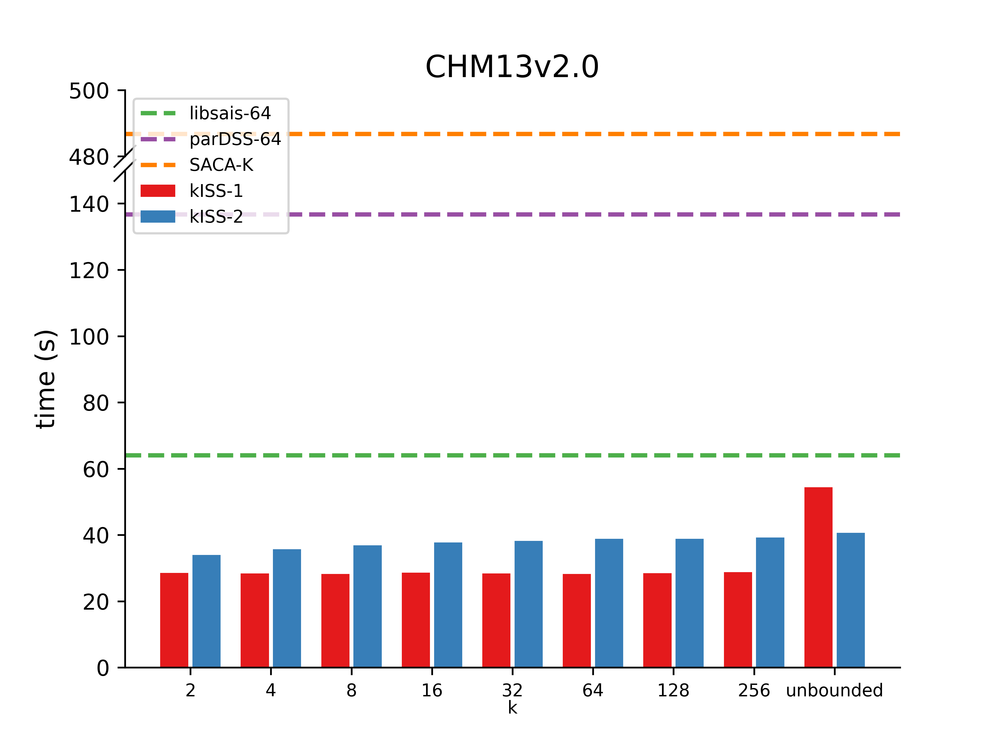
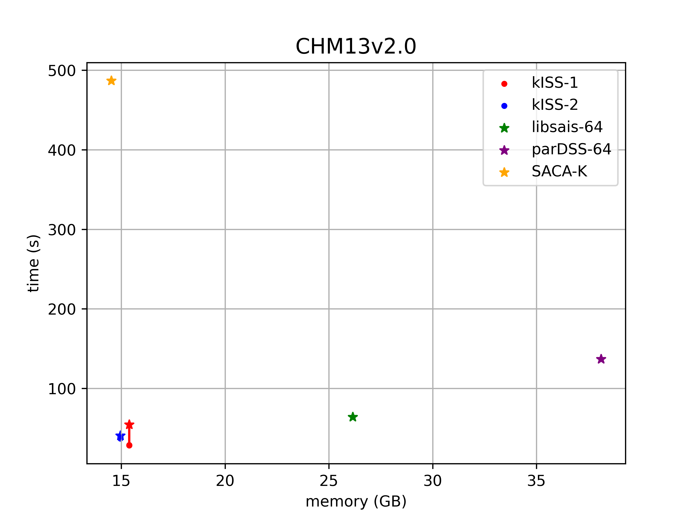
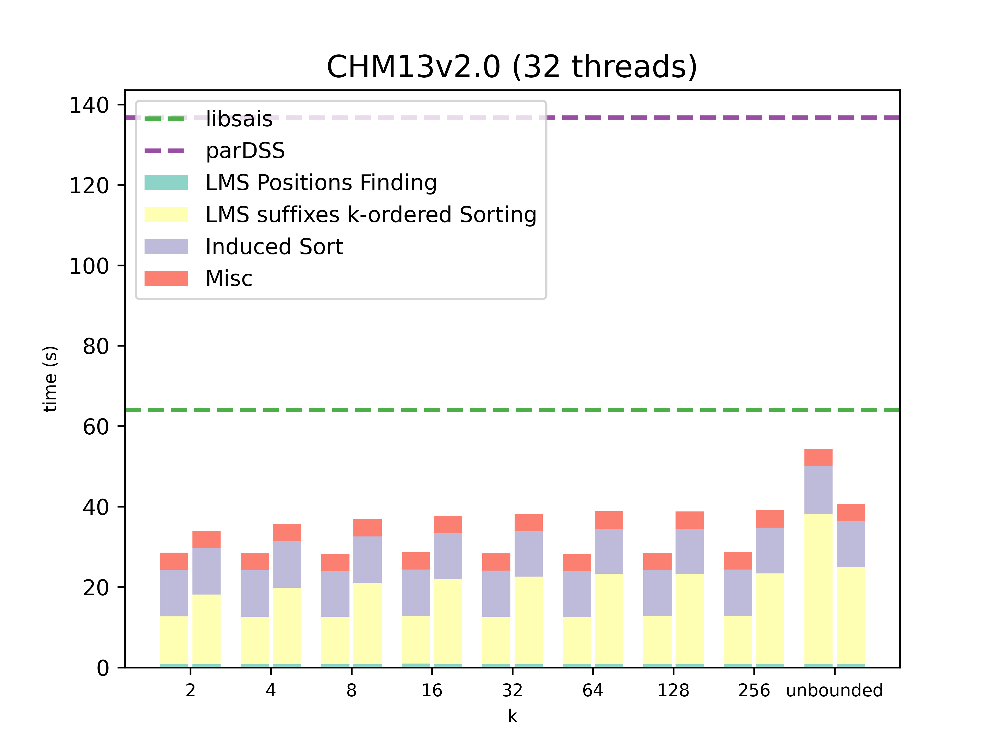
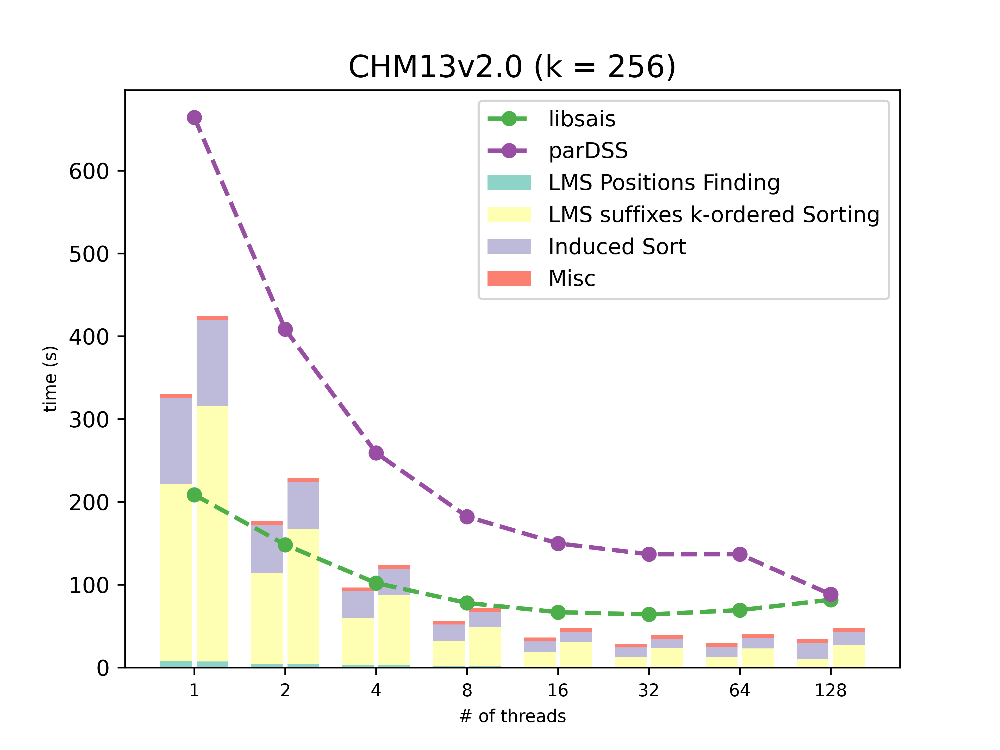

# Experimental scripts

This folder contains the experimental scripts for "Efficient Construction and Utilization of k-ordered FM-indexes with kISS for Ultra Fast Read Mapping in Large Genomes," including measurement of time and space usage for constructing suffix arrays and result visualization.

To replicate the results in the paper, follow these steps:

1. Follow the "Installation steps" [here](https://github.com/jhhung/kISS) to generate the experimental execution files.
2. Download the FASTA files described in Table S1 and place them under a directory of your choice. Rename the FASTA files to `chm13v2.0.fa`, `mouse.fa`, `zebrafish.fa`, `human_protein_5640.fa`, `mouse_protein_589.fa`, and `zebrafish_protein_437.fa`, respectively.
3. Create a directory for storing the log files.
4. Run the following commands:
```
./experiment_a.sh $YOUR_DATA_DIR $YOUR_LOG_DIR
./experiment_b.sh $YOUR_DATA_DIR $YOUR_LOG_DIR
```
Replace `$YOUR_DATA_DIR` with the directory storing all the FASTA files, and `$YOUR_LOG_DIR` with the directory where you wish to store the log files.


These scripts generate two CSV files: `experiment_32_threads.csv` (Results under 32 threads, Figure 3a to 3c and S1 to S3) and `experiment_k_256.csv` (Results with k = 256, Figure 3d and S4). Log files are generated under `$YOUR_DATA_DIR`. The CSV files provide a summary of the experimental results, including the suffix array construction algorithm, the testcase name, the value of k (k = -1 for unbounded sorting), number of threads, time usage in seconds, and memory usage in bytes. The log files describe the time usage for each step of the kISS algorithms. These files can be used to generate all figures throughout the paper.

## Benchmark

### Comparison of Different k-values with Same Number of Threads
Using the CHM13v2.0 dataset, we evaluated the performance of various suffix sorting algorithms with a fixed number of 32 threads. We compared the single-threaded SCAC-K, the multi-threaded parDSS (libsais), and kISS across different k-values. Notably, kISS outperformed others consistently across various k-values. Specifically, kISS-1 demonstrated superior performance for smaller k-values, while kISS-2 exhibited stable performance even for larger k-values, including the complete suffix array.
<p align="center">
  
</p>

### Time-Memory Tradeoff
Analyzing the relationship between time and memory usage with the CHM13v2.0 dataset and 32 threads, kISS achieved a balanced tradeoff between time and memory. It approached the memory consumption of SACA-K while requiring less time compared to other algorithms.
<p align="center">
  
</p>

### Time Distribution across Stages for Different k-values
In the evaluation with the CHM13v2.0 dataset and 32 threads, kISS showcased notable time distribution across its stages. The majority of time consumption was observed in the LMS suffixes k-ordered sorting stage.
<p align="center">
  
</p>

### Time Distribution across Stages with Different Thread Counts
Keeping k-value fixed at 256, and using the CHM13v2.0 dataset, kISS exhibited significant parallelization efficiency, particularly in the parallelization of LMS suffixes k-ordered sorting. Following that, induced sorting was the next significant time-consuming stage.
<p align="center">
  
</p>
